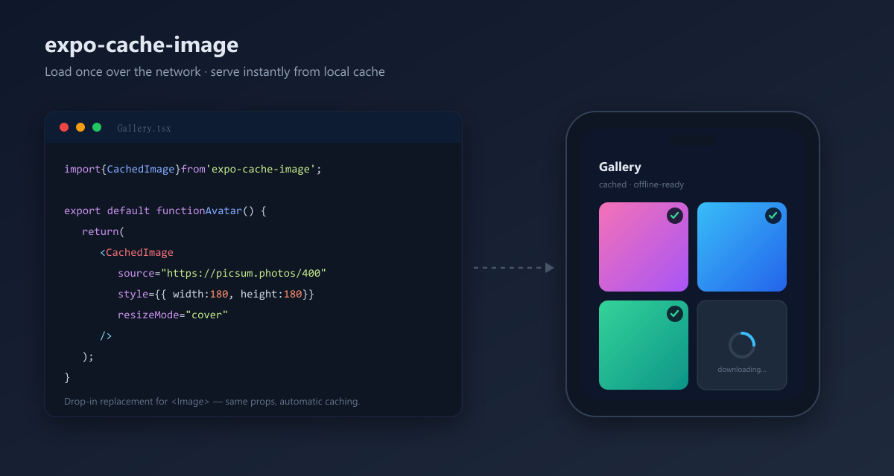

# expo-cache-image

[](https://www.npmjs.com/package/expo-cache-image)
[](https://www.npmjs.com/package/expo-cache-image)
[](https://bundlephobia.com/package/expo-cache-image)
[](./LICENSE)

A tiny, dependency-light **image caching** solution for Expo / React Native apps.

When an image is loaded over the internet it is downloaded **once**, stored on
the device's local filesystem, and served from that local copy on every
subsequent load — making images appear instantly, reducing bandwidth, and
working offline.

- 🖼️ `<CachedImage>` — a drop-in replacement for `<Image>`
- ⚡ Deduplicated downloads — the same URL is never fetched twice concurrently
- 📦 Imperative helpers — `prefetch`, `clearCache`, `getCacheSize`, and more
- 🔌 Works across Expo SDKs — supports both the legacy and the new
  `expo-file-system` APIs automatically
- 🪶 No native code, no extra crypto dependency

## Installation

```sh
npx expo install expo-cache-image expo-file-system
```

`expo-file-system`, `react`, and `react-native` are peer dependencies and are
already present in any Expo app.

## Quick start

```tsx
import { CachedImage } from 'expo-cache-image';

export default function Avatar() {
  return (
    <CachedImage
      source="https://picsum.photos/400"
      style={{ width: 200, height: 200, borderRadius: 12 }}
      resizeMode="cover"
    />
  );
}
```

`CachedImage` accepts every prop that React Native's `<Image>` accepts. The
`source` may be a string URL, an `{ uri }` object, or a local `require(...)`
asset (local assets are rendered directly without caching).



_On first load each remote image is downloaded and cached; the placeholder
spinner shows while a tile downloads, and every later render is served instantly
from local storage — even offline._

### Placeholder & fallback

```tsx
<CachedImage
  source={{ uri: 'https://example.com/photo.jpg' }}
  style={{ width: 120, height: 120 }}
  placeholder={<ActivityIndicator color="#888" />} // shown while downloading
  fallback={<Text>⚠️</Text>}                        // shown if it fails
  onCached={(localUri) => console.log('cached at', localUri)}
  onCacheError={(err) => console.warn(err)}
/>
```

Pass `placeholder={null}` to render an empty box while loading instead of the
default spinner.

## Imperative API

```ts
import {
  cacheImage,
  prefetch,
  getCachedUri,
  isCached,
  removeCachedImage,
  clearCache,
  getCacheSize,
  localUriForRemote,
} from 'expo-cache-image';
```

| Function | Description |
| --- | --- |
| `cacheImage(url)` | Ensures the image is cached and resolves with the **local file URI**. Downloads it if needed. |
| `prefetch(url \| url[])` | Pre-downloads one or many images. Resolves with the URLs that were cached successfully. |
| `getCachedUri(url)` | Resolves with the local URI if already cached, otherwise `null`. No network request. |
| `isCached(url)` | Resolves `true`/`false`. |
| `removeCachedImage(url)` | Deletes a single cached image. |
| `clearCache()` | Removes every image cached by this package. |
| `getCacheSize()` | Resolves with the total cache size in **bytes**. |
| `localUriForRemote(url)` | Returns the deterministic local path for a URL (sync, no I/O). |

### Example: warm the cache, then show a gallery

```tsx
import { useEffect } from 'react';
import { prefetch, CachedImage } from 'expo-cache-image';

const urls = [
  'https://picsum.photos/id/10/400',
  'https://picsum.photos/id/20/400',
  'https://picsum.photos/id/30/400',
];

export function Gallery() {
  useEffect(() => {
    prefetch(urls); // download in the background
  }, []);

  return urls.map((u) => (
    <CachedImage key={u} source={u} style={{ width: 400, height: 400 }} />
  ));
}
```

### Example: a "clear cache" settings button

```tsx
import { Button } from 'react-native';
import { clearCache, getCacheSize } from 'expo-cache-image';

async function showAndClear() {
  const bytes = await getCacheSize();
  console.log(`Cache is ${(bytes / 1024 / 1024).toFixed(1)} MB`);
  await clearCache();
}

<Button title="Clear image cache" onPress={showAndClear} />;
```

## How it works

1. Each remote URL is hashed (FNV-1a) into a stable filename, preserving the
   original extension — e.g. `https://x.com/cat.png` → `1a2b3c4d.png`.
2. Files live in a dedicated `expo-cache-image/` folder inside the app's
   **cache directory** (`FileSystem.cacheDirectory` / `Paths.cache`).
3. Before any download, the local file is checked; if present and non-empty it
   is reused. Otherwise the image is downloaded with `expo-file-system` and then
   served from disk.
4. Because files live in the OS cache directory, the system may reclaim them
   under storage pressure — exactly the right semantics for an image cache.

## Expo SDK compatibility

`expo-cache-image` detects which `expo-file-system` API is available at runtime:

- **SDK ≤ 53** — uses the classic function API (`downloadAsync`, `getInfoAsync`…).
- **SDK ≥ 54** — uses the new class-based API (`File`, `Directory`, `Paths`).

No configuration is required. If your SDK 54+ setup only exposes the legacy
functions via `expo-file-system/legacy`, that path is supported automatically as
well.

## License

MIT
